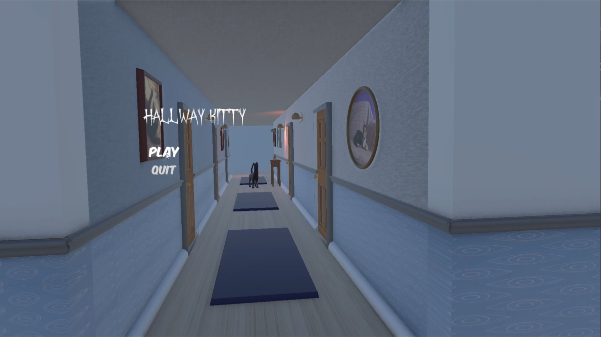
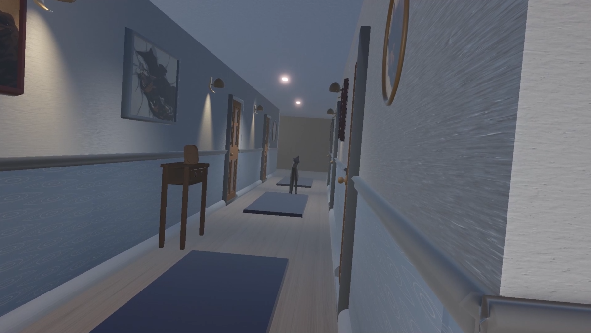
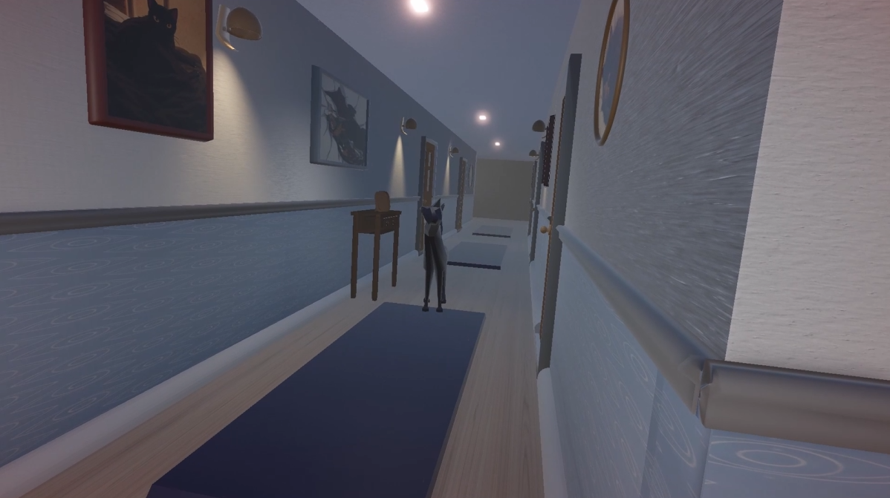
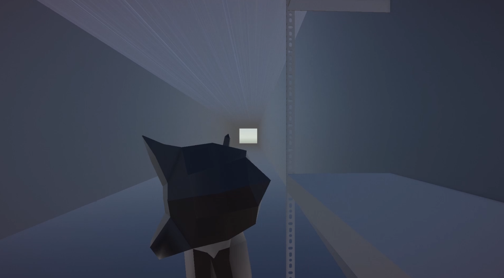

# Hallway Kitty

A short first-person horror game built in **Unity and C#**, where Kitty moves closer whenever you stop watching.

## About

**Hallway Kitty** is a short horror game where the player must keep an eye on a mysterious cat lurking at the end of a hallway.

When the player looks away, Kitty begins moving closer and can randomly teleport to its next position. As it approaches, its appearance becomes increasingly corrupted, eventually leading to a chase sequence where the player must escape.

## Gameplay

  
  

### Features

- Raycast-based enemy visibility detection
- Enemy movement based on whether the player is watching
- Randomised movement and teleport timing
- Multiple Kitty forms that change as the game progresses
- First-person movement and camera effects
- Scripted chase sequence
- Obstacle and collision detection
- Jumpscare system with camera shake and sound
- Main menu and scene management
- Win and failure states
- Custom character models, rigging and animations

## The Monster

  

Kitty becomes progressively more distorted as it approaches the player, with custom models and animations created in Blender.

## How It Works

The core enemy mechanic uses **raycasting** from the player's camera to determine whether Kitty is being observed.

While Kitty is visible, its movement is paused. When the player looks away, Kitty can creep toward its next position or teleport after a random interval.

After Kitty reaches its final position, the game transitions into a chase sequence where the player must avoid obstacles and reach the end of the hallway.

## Built With

- **Unity 6** — Game engine
- **C#** — Gameplay programming
- **Blender** — 3D modelling, rigging and animation
- **TextMeshPro** — UI and menu text

## What I Learned

This project gave me practical experience building a complete gameplay loop in Unity, including:

- Raycasting and line-of-sight detection
- Collision and trigger systems
- CharacterController movement
- Gameplay state management
- Scene management
- UI events
- Audio integration
- Importing and controlling Blender animations in Unity

It also gave me experience debugging interactions between Unity components, colliders, GameObject hierarchies and imported 3D assets.

## Status

**Completed — August 2026**

Hallway Kitty was developed as a small personal project focused on learning Unity, C# and 3D game development.
